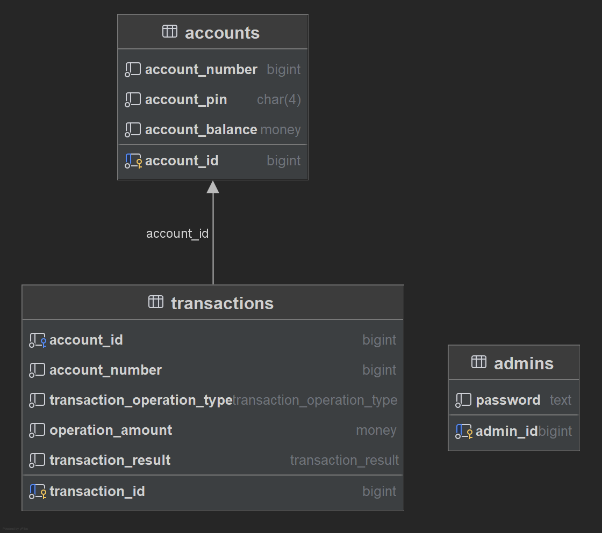

# ATM-system

## Описание

Проект реализует систему банкомата: позволяет снимать деньги со счета и пополнять его, делает необходимые проверки
сумм, позволяет просматривать баланс счета и историю транзакций. 

Есть система авторизации с разделением на обычных
пользователей и админов.

## Функционал

- Создания счета (счет имеет номер, пинкод для входа, привязку к пользователю)
- Просмотр баланса счета
- Снятие денег со счета (выполняется проверка достаточности баланса)
- Пополнение счета (выполняется валидация величины пополнения)
- Просмотр истории операций
- Для выполнения операций пользователь должен пройти аутентификацию

## Особенности проекта

- Луковая архитектура. Код разделен на слои: представление, приложение, инфрастуктура.
- Написаны E2E тесты
- Используются GoF паттерны
- Solid принципы
- Grasp принципы

## Технологии

- С#
- Docker
- PostgreSQL
- NUnit - фреймворк для тестирования

## Стартовое окно

## Схема базы данных

